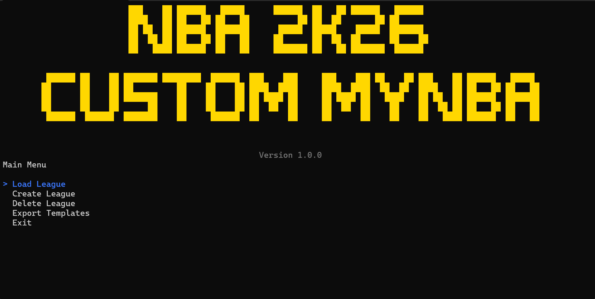
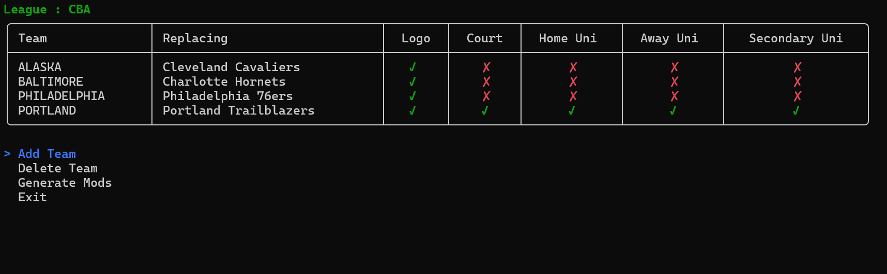
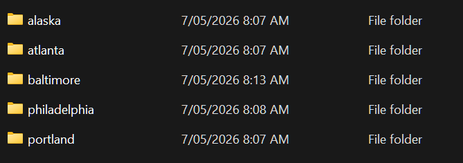
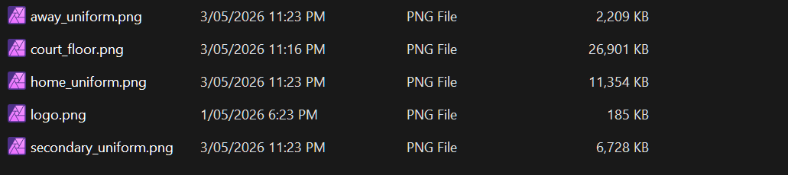

# NBA 2K26 Custom MyNBA

This is a small application to help people create custom MyNBA teams without needing to upload images to the MyNBA website.  It utilises the `mods` capability of NBA 2K26 to replace existing textures to allow customisation/relocation of teams in NBA 2K26 to create unique teams for something different.

The aim of this app is to make it easy for people to go from creating PNG files to having them usable inside the NBA 2K26 game.

## Prerequisites

This app does not contain _everything_ it needs to run successfully.  It is dependent on two external tools to run:

+ **Texconv** - A free Microsoft command-line tool for converting images to specific DDS formats.  Download/installation instructions can be found here: https://github.com/microsoft/DirectXTex/wiki/texconv
+ **7zip** - A free universal tool for managing archives.  Needed by the app to package converted graphics into NBA2K IFF files.  7zip can be downloaded and installed from here: https://www.7-zip.org/download.html

## How The App Works

The app comes pre-packaged with compatible IFF files for NBA 2K26 along with a court and uniform template.  Create your logos, court floors and uniforms in your favourite image program and save them as PNG files in a specific location.

You then create a league in the app where you can map new teams to existing resources inside NBA2K26.  Once you have completed the mapping, you can then export your work and the app will generate a list of IFF files you can then copy into the `mods` folder of your NBA 2K26 install.

After doing that, you then use the relocation/customisation option on teams to apply the uniforms and stadium edits as needed.

This allows localised creation of custom teams in NBA 2K26 without needing to upload artwork to the NBA2K26 servers and waiting up to 72 hours for them to become available.

There is a FAQ section below as well.

## Installation

Simply download the latest published EXE from https://github.com/OzWolf/nba2k26-custom-mynba/releases and place in a folder you will be working in.

## Directory Information

When the application runs for the first time, it will create a number of directories it will need.  These are:

+ `mods` - Created alongside the exe.  This will be where the app will place generated IFF files.
+ `work` - Created alongside the exe.  This will be where the app places its converted DDS files before packing them in IFF files.
+ `teams` - Created alongside the exe.  This is the directory for you to create team folders containing source PNG images for the app to convert into usable IFF mod files.
+ `%APPDATA%\NBA2K26CustomMyNBA` - A shared directory for the app to place it's storage JSON file containing your custom mappings.  This allows you to close down the app and restart it while working and for the app to remember your choices.

## Main Menu

+ **Load League** - Select a league to load and manage that you created previously.
+ **Create League** - Create a new league and begin managing the team mappings.
+ **Delete League** - Delete a league and it's team mappings.
+ **Export Templates** - Export the uniform and court floor templates 7z file to the app directory for use.

## Image Templates

The app contains a 7z file that can be exported via the main menu that contains template files for uniforms and court floors.

They come in both Photoshop PSD and Affinity Photo formats.  See below for using and applying them in game.

## League Management

Once you load a team, you will be presented with a screen similar to the one above.

You can define up to 36 teams to be customised.  This covers the 30 NBA teams and 6 expansion teams, enough to customise an entire MyNBA experience.

+ **Add Team** - Will ask the name of the new team.  This should be the name of the folder where the team's associated media will be stored.
+ **Delete Team** - Remove a team mapping.
+ **Generate Mods** - Will run across the teams configured in the league and generate appropriate IFF mod files where the teams have an existing PNG.  A missing image will get skipped (meaning you can generate logos-only if you want to).

## Team Images

Images for a team are discovered by the file system relative to where the app is being run.  Each team should be setup with their own folder under the `teams` folder the app creates at startup.

The five images a team can have are:

+ `logo.png` - A 1024 x 1024 file of the team logo.
+ `court_floor.png` - A 8192 x 4096 file of the team's court floor.
+ `home_uniform.png` - A 4096 x 4096 file of the team's home uniform.
+ `away_uniform.png` - A 4096 x 4096 file of the team's away uniform.
+ `secondary_uniform.png` - A 4096 x 4096 file of the team's secondary uniform.

Reminder: The app contains a 7z file with court floor and uniform templates in it.  Use the **Export Templates** option in the main menu to extract that file for use.

### Teams Folder

### Team Folder

## Customise A Team

To customise a team, you will need to use the Relocation feature for each one and use the following steps:

1. Choose your team's actual city (even if it's the one the team is already in).
2. Set the team's name.
3. Set the team's colors.
4. For each uniform, set the uniform to empty white.  Then load the team's uniform from the appropriate logo.
   1. Scale the image to 4.40.
   2. Set the image coordinates as -0.34, 0.17.  This should center it properly on the body.
   3. Adjust numbers and names as needed.
5. Edit the team stadium _only_!
   1. If you edit the stadium floor, it will overwrite your custom floor with whatever the relocation tool provides.  Editing the stadium ensures you have the arena you want and clears out the replaced teams remnants in-game.

### Uniform Best Results

After testing, the uniform best results are produced by removing the background and leaving your logos and patterns in place and saving the PNG with a transparent background.

Then in the game, set your uniform base colour the way you normally would, along with the neck, shoulder, and belt stripes, then overlay the uniform logo.  This ensures minimal visible seams in the process.

### Expansion Teams

If you are wanting to play a 36 team league, there are six expansion teams that can be replaced:

+ Kansas City Knights
+ Nashville Stars
+ Pittsburgh Force
+ San Diego Surf
+ Virginia Storm
+ Vancouver Ravens

When you expand the league with one of these teams, you will get your custom logo and custom court floor.  Your uniform images will be in slightly different locations to the primary 30 NBA teams and is outlined below.

### Uniform Images In Game

Uniform images can be found under the logos in different areas.

For the 30 NBA teams, you can find your uniforms under:
+ Home Uniform - NBA Secondary
+ Away Uniform - NBA Partial
+ Secondary Uniform - NBA Partial B&W

For the 6 expansion teams, your uniforms can be found in:
+ Home Uniform - Presets
+ Away Uniform - WNBA Primary
+ Secondary Uniform - WNBA Primary

## FAQ

### Why is the EXE so big?!?

The executable contains the template PSD and Affinity Photo files.  The court floor template in particular takes up a lot of space.

### Can I go online using this?

Absolutely.  This app does nothing to subvert the mod-support options for NBA 2K26.  It is merely a localised texture replacement capability, wrapped up in a nice app to make it easier for people to create custom teams.

### I accidentally edited my court floor, how do I get it back?

You don't.  It's the same as editing an NBA team and editing the court floor.  The moment you enter that screen, the base floor texture is lost to the gods of `/dev/null`.

### What if I upload my teams to the server?

For anyone else pulling down your team, it might look kinda rubbish, such as your home uniform being just a super-sized copy of the Lakers logo.  As long as your mods folder for NBA 2K26 has not been cleared, your local game will replace those textures.